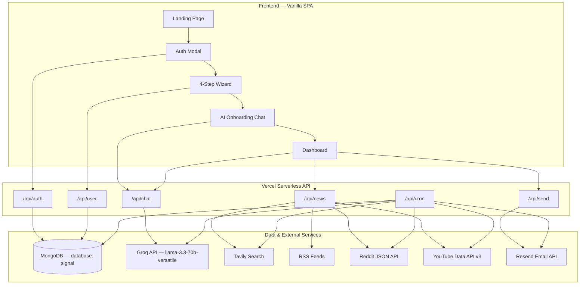

# Signal (AI Digest) — Project Audit

**Audit date:** June 5, 2026  
**Auditor role:** Senior software architect (read-only review)  
**Repository:** `https://github.com/rssharifu-cmd/ai-digest.git`  
**Local path:** `c:\Users\h\Downloads\ai-digest-main (4)\ai-digest-main`  
**Product name:** Signal (legacy references: Sharflow)

---

## Executive Summary

Signal is a lean MVP for a personalized AI news digest: a vanilla HTML/CSS/JS SPA hosted on Vercel, backed by seven serverless Node.js API routes, MongoDB, Groq (Llama 3.3 70B), multi-source news ingestion, and Resend email delivery. The core user journey—signup → 4-step onboarding → AI chat → profile lock → dashboard digest generation—is wired end-to-end and appears functional when environment variables are configured.

The project is **not production-hardened**. Critical gaps include unauthenticated access to expensive APIs (`/api/chat`, `/api/news`, `/api/send`), optional cron security, ignored user preferences (`digestTime`, `active`, `customSources`, `tone`), pipeline inconsistency between dashboard and cron (RSS missing in cron), and an unintegrated legacy settings patch (`sharflow_settings_dashboard.html`) that would break the app if pasted in.

**Overall maturity:** Functional prototype / pre-production MVP.

---

## 1. Current Architecture

### 1.1 High-Level Diagram



### 1.2 Frontend

| Aspect | Detail |
|--------|--------|
| **Stack** | Vanilla HTML5, CSS3, JavaScript (no framework, no bundler) |
| **Entry** | `index.html` |
| **Logic** | `js/app.js` (~925 lines) |
| **Styles** | `css/app.css` (CSS variables, DM Sans + Instrument Serif) |
| **Routing** | No client router; views toggled via `.hidden` class |
| **Hosting** | Vercel rewrite: all non-API paths → `index.html` |

**Views (mutually exclusive panels):**

1. `#landing-view` — Marketing / landing page
2. `#onboarding-view` — 4-step profile wizard
3. `#chat-view` — AI fine-tuning conversation
4. `#dashboard-view` — Sidebar + 3 panels (overview, digest, profile)

**State management:** All client state in `localStorage`:

| Key | Purpose |
|-----|---------|
| `signal_jwt_token` | JWT auth token |
| `signal_email` | User email |
| `signal_profile_form` | Onboarding form JSON |
| `signal_profile` | AI-generated profile summary text |
| `signal_lock_until` | 7-day profile lock ISO timestamp |
| `signal_messages` | Chat history (cleared on confirm) |
| `signal_plan` | Plan tier (`starter` default; never set in main app) |
| `signal_last_digest` / `signal_last_digest_date` | Cached digest content |

**Key frontend flows:** `handleSignup` / `handleLogin` → onboarding → `submitChat` → `generateProfileSummary` → `handleAccept` → `showDashboard` → `fetchPersonalizedDigest` → `sendDigestEmail`.

### 1.3 Backend

| Aspect | Detail |
|--------|--------|
| **Runtime** | Vercel serverless Node.js (≥18) via `@vercel/node` ^3.2.29 |
| **Pattern** | Flat monolith — no service layer, no shared middleware in use |
| **Dependencies** | `bcryptjs`, `jsonwebtoken`, `mongodb` |

**API routes** (defined in `vercel.json`):

| Route | File | Methods | Auth |
|-------|------|---------|------|
| `/api/auth` | `api/auth.js` | GET, POST | GET requires Bearer JWT |
| `/api/user` | `api/user.js` | GET, POST | Bearer JWT required |
| `/api/chat` | `api/chat.js` | GET, POST | **None** |
| `/api/news` | `api/news.js` | GET, POST | **None** |
| `/api/send` | `api/send.js` | GET, POST | **None** |
| `/api/cron` | `api/cron.js` | GET | `CRON_SECRET` (optional) |

**Unused code:** `api/authMiddleware.js` — CORS allowlist + `extractEmail()` helper; **never imported** by any route. All live routes use `Access-Control-Allow-Origin: *`.

**Dead duplicate:** `send.js` at repo root is identical to `api/send.js` but is **not routed** by Vercel.

### 1.4 Database

| Aspect | Detail |
|--------|--------|
| **Engine** | MongoDB Atlas (native driver `mongodb` ^6.5.0) |
| **Database name** | `signal` (hardcoded in `api/db.js`) |
| **ORM** | None |
| **Migrations** | None |
| **Schema** | Schemaless — shapes inferred from application code |
| **Connection** | Singleton via `global._mongoClientPromise` (warm-invocation reuse) |
| **Indexes** | None defined in code |

**Collection: `users`**

```javascript
{
  email: string,              // unique lookup key (no index declared)
  name: string,
  passwordHash: string,         // bcrypt, 10 rounds
  plan: "starter" | "pro",
  active: boolean,              // default false — intended for Stripe gating
  profile: {
    summary, profession, topics, avoid,
    customSources, tone, digestTime,  // default "08:00"
    lockedUntil: Date | null,
    savedAt: Date
  } | null,
  createdAt, updatedAt, lastLoginAt
}
```

**Collection: `digests`** (write-only from cron; never read via API)

```javascript
{
  userId: ObjectId,
  email: string,
  content: string,            // plain-text digest
  sentAt: Date,
  date: "YYYY-MM-DD"
}
```

### 1.5 Authentication

| Aspect | Detail |
|--------|--------|
| **Signup** | `POST /api/auth` `{ action: "signup", email, password, name }` → bcrypt hash → insert user → return JWT |
| **Login** | `POST /api/auth` `{ action: "login", email, password }` → bcrypt compare → update `lastLoginAt` → JWT |
| **Token verify** | `GET /api/auth` with `Authorization: Bearer <token>` |
| **JWT** | `jsonwebtoken`, 7-day expiry, payload: `{ email, name }` |
| **Secret** | `JWT_SECRET` env var (required) |
| **Client storage** | `localStorage` (`signal_jwt_token`) |
| **Protected routes** | `/api/user` only (plus GET `/api/auth`) |

**Not implemented:** Server-side logout, token revocation, refresh tokens, rate limiting, password reset, email verification.

### 1.6 Email System

| Aspect | Detail |
|--------|--------|
| **Provider** | Resend REST API (`https://api.resend.com/emails`) |
| **Env vars** | `RESEND_API_KEY`, `FROM_EMAIL` |
| **Templates** | Inline HTML strings in `api/send.js` and duplicated in `api/cron.js` |

**Email types:**

| Action | Template | Trigger |
|--------|----------|---------|
| `welcome` | `welcomeHtml()` | `handleAccept()` after profile confirmation |
| `digest` | `digestHtml()` | Dashboard "Email me" button |
| Cron digest | Inline HTML in `cron.js` | Daily Vercel cron at 08:00 UTC |

**Scheduling:** Single global cron — `0 8 * * *` UTC in `vercel.json`. Per-user `digestTime` from onboarding is **stored but never used** by the cron job.

**Placeholder links:** Unsubscribe, privacy, and preferences links are `href="#"` stubs. Welcome CTA points to hardcoded `https://signal.app`.

### 1.7 News Ingestion Pipeline

**Dashboard path:** `POST /api/news` (`api/news.js`)

Parallel fetch via `Promise.allSettled`:

| Source | Function | API Key | Max Items |
|--------|----------|---------|-----------|
| Tavily | `fetchTavilyNews()` | `TAVILY_API_KEY` | 6 |
| RSS | `fetchRSSFeeds()` | None | 4 (topic-mapped) |
| Reddit | `fetchRedditPosts()` | None | 4 |
| YouTube | `fetchYouTubeVideo()` | `YOUTUBE_API_KEY` | 1 |

RSS feeds are selected by keyword match in user topics (TechCrunch AI, BBC Business, Smashing Magazine, etc.). Default fallback: BBC top stories.

**Output:** Structured `content` object + pre-formatted `text` blocks (`articles`, `reddit`, `video`) passed to the AI digest prompt.

**Cron path:** `api/cron.js` inline `fetchNews()` — fetches Tavily, Reddit, YouTube only. **RSS is documented but not implemented.** Custom sources from user profile are **not used** in either path.

### 1.8 AI Generation Pipeline

| Aspect | Detail |
|--------|--------|
| **Provider** | Groq OpenAI-compatible API |
| **Endpoint** | `https://api.groq.com/openai/v1/chat/completions` |
| **Model** | `llama-3.3-70b-versatile` |
| **Env var** | `GROK_API_KEY` (misleading name — this is Groq, not xAI Grok) |

**`/api/chat` actions:**

| Action | Purpose | Max Tokens | Temperature |
|--------|---------|------------|-------------|
| `chat` | Onboarding follow-up (3–5 turns) | 600 | default |
| `summary` | Profile summary from form + chat | 1000 | default |
| `digest` | Personalized daily digest | 1400 (starter) / 1800 (pro) | 0.35 |

**Dashboard digest flow:**
1. Frontend calls `/api/news` with `topics`, `profession`, `avoid`
2. Builds `newsContext` from response text blocks
3. Calls `/api/chat` action `digest` with profile narrative + plan + newsContext
4. If no news: generates profile-only preview with `[Preview — connect Tavily API for live news]` prefix

**Cron digest flow:** Separate `generateDigest()` in `cron.js` with a different prompt format (includes "Community Buzz" section). Uses 30s timeout vs 45s in chat route.

---

## 2. What Currently Works

Assessment assumes Vercel deployment with all required environment variables configured (`MONGODB_URI`, `JWT_SECRET`, `GROK_API_KEY`, `TAVILY_API_KEY`, `RESEND_API_KEY`, `FROM_EMAIL`, `CRON_SECRET`).

| Feature | Status | Notes |
|---------|--------|-------|
| **User registration** | ✅ Works | Signup → bcrypt hash → MongoDB insert → JWT returned |
| **Login** | ✅ Works | Password verify, JWT returned, profile hydrated from server |
| **Onboarding** | ✅ Works | 4-step wizard validates inputs, saves to localStorage, launches chat |
| **AI onboarding chat** | ✅ Works | Groq-powered follow-up, auto-triggers summary after wrap-up keywords |
| **Profile confirmation** | ✅ Mostly works | Saves to MongoDB + localStorage, sends welcome email (fire-and-forget) |
| **Dashboard** | ✅ Works | Greeting, profile display, lock countdown, digest panels |
| **News fetching** | ✅ Works | Tavily + RSS + Reddit + YouTube in parallel (when keys present) |
| **Personalization** | ✅ Partial | AI digest uses profile + live news; tone/customSources not fed to pipeline |
| **Manual digest generation** | ✅ Works | "Generate today" fetches news → Groq digest → caches in localStorage |
| **Manual email send** | ✅ Works | "Email me" sends current digest via Resend |
| **Daily email delivery** | ⚠️ Conditional | Cron runs at 08:00 UTC for all users with `profile.summary`; ignores `active`, `digestTime`; missing RSS vs dashboard |

**Infrastructure that works when configured:**
- Vercel SPA routing (all paths → `index.html`)
- MongoDB connection pooling across warm invocations
- CORS on all API routes (permissive `*`)
- Digest archival to `digests` collection (write-only)

---

## 3. What Is Broken

### 3.1 Bug Registry

| # | Bug | Root Cause | Severity |
|---|-----|------------|----------|
| 1 | **Unauthenticated `/api/send`** — anyone can send welcome/digest emails to arbitrary addresses | No JWT or API-key check on `api/send.js` | **Critical** — email abuse, Resend quota burn, deliverability damage |
| 2 | **Unauthenticated `/api/chat`** — anyone can invoke Groq at your cost | No auth middleware on `api/chat.js` | **Critical** — API cost abuse |
| 3 | **Unauthenticated `/api/news`** — open news proxy | No auth on `api/news.js` | **High** — abuse of Tavily/YouTube quotas |
| 4 | **`CRON_SECRET` is optional** — cron endpoint publicly triggerable if env var unset | `api/cron.js` only checks auth when `CRON_SECRET` is non-empty | **Critical** — unauthorized mass email + Groq spend |
| 5 | **`active: false` never enforced** — unpaid/inactive users receive daily cron emails | Cron queries `profile != null` only; ignores `active` flag set at signup | **High** — business logic bypass; emails to non-paying users |
| 6 | **Per-user `digestTime` ignored** — all users emailed at 08:00 UTC | Cron schedule is global in `vercel.json`; no per-user time filtering in `cron.js` | **High** — wrong delivery time; timezone UX broken |
| 7 | **RSS missing in cron pipeline** — cron digests lack RSS articles dashboard includes | `cron.js` `fetchNews()` implements Tavily/Reddit/YouTube only; header comment claims RSS | **Medium** — inconsistent digest quality between manual and automated |
| 8 | **`customSources` never used in news fetch** — user-specified sources stored but ignored | `apiNews()` sends only `topics`, `profession`, `avoid`; news API has no custom source logic | **Medium** — advertised feature non-functional |
| 9 | **`tone` never passed to AI digest** — tone preference saved but not in prompt | `api/chat.js` digest action has no `tone` field; `fetchPersonalizedDigest()` doesn't send it | **Medium** — personalization gap |
| 10 | **Login after lock expiry forces re-onboarding** — returning users lose dashboard access | `handleLogin()` routes to `showOnboarding()` when `lockedUntil` is past, even if server profile exists | **High** — broken return-user UX |
| 11 | **Page load ignores valid JWT** — refresh shows landing if lock expired locally | `window.onload` only checks `localStorage` lock/profile, never validates JWT or fetches server state | **Medium** — session continuity broken across devices/expiry |
| 12 | **`sharflow_settings_dashboard.html` not integrated and broken if pasted** | Standalone patch references `main-shell`, `app-nav-btns`, `showOnboardingForm()`, `showLockedView()` — none exist in `index.html`; uses `signal_token` vs app's `signal_jwt_token` | **High** — dead code; integration would break auth |
| 13 | **Settings `saveSettings()` sends `settings` object server ignores** | `api/user.js` POST handler has no `body.settings` handling | **Medium** — false "saved" UX in Sharflow patch |
| 14 | **Password change is fake** — shows success toast, no API call | Sharflow patch `saveSettings('password')` only clears fields locally | **Medium** — security UX deception |
| 15 | **Pro plan never activated in main app** | `signal_plan` defaults to `starter`; no UI to upgrade; Stripe marked "Week 4" | **Low** — pro features (extra sections) unreachable |
| 16 | **`user.js` upsert can create phantom users** | `updateOne({ email }, update, { upsert: true })` can insert user without `passwordHash` if JWT is valid | **Medium** — data integrity risk |
| 17 | **Profile/email saves are fire-and-forget** — silent failures on confirm | `handleAccept()` uses `.catch()` with no user feedback for `/api/user` and `/api/send` | **Medium** — user thinks profile saved when it may not be |
| 18 | **`resetAll()` is not real logout** — clears localStorage only | No server token invalidation; JWT remains valid for 7 days | **Low** — misleading "signed out" message |
| 19 | **Digest history stored but never exposed** | `digests` collection written by cron; no GET endpoint or dashboard UI | **Low** — incomplete feature |
| 20 | **Cron sequential loop risks Vercel timeout** | Users processed one-by-one with 500ms sleep; each user = news + Groq + email (~30s+ possible) | **High** — cron may fail silently for users beyond timeout window |
| 21 | **Cron Groq timeout shorter than dashboard** | Cron: 30s; chat route: 45s — cron more likely to fail on slow responses | **Medium** — intermittent cron failures |
| 22 | **`authMiddleware.js` dead code** | Written for Sharflow CORS/domains; never wired into routes | **Low** — maintenance confusion |
| 23 | **Duplicate `send.js` at repo root** | Copy of `api/send.js`, not in `vercel.json` routes | **Low** — drift risk |
| 24 | **Brand/naming inconsistency** | Signal (current) vs Sharflow (legacy files, CORS domains) | **Low** — developer confusion |
| 25 | **Email template hardcoded domain** | Welcome CTA links to `https://signal.app` regardless of deploy URL | **Low** — broken link in production |
| 26 | **YouTube search query hardcodes `2025`** | `fetchYouTubeVideo()` appends `2025` to search query | **Low** — degrading relevance over time |
| 27 | **No `.env.example`** | Env vars documented only in README | **Low** — onboarding friction for developers |
| 28 | **MongoDB throws at module import if `MONGODB_URI` missing** | `api/db.js` throws on import — all DB routes fail hard | **Medium** — poor local-dev ergonomics |
| 29 | **Sharflow patch overrides auth with incompatible min password** | Patch requires 8-char password on signup; main app allows 6 — conflict if integrated | **Medium** — validation inconsistency |

### 3.2 Severity Legend

| Level | Meaning |
|-------|---------|
| **Critical** | Security vulnerability or direct financial/abuse risk in production |
| **High** | Core feature broken or significant user/business impact |
| **Medium** | Feature partially works or UX/data integrity degraded |
| **Low** | Cosmetic, maintenance, or future-facing gap |

---

## 4. Deployment Status

### 4.1 Git Status (as of audit)

| Check | Result |
|-------|--------|
| **Branch** | `main` |
| **Tracking** | `origin/main` — up to date |
| **Working tree** | Clean — nothing to commit |
| **Local HEAD** | `f1ceb396f838e60c0f5dccbfecc5f373f88282c9` |
| **Remote HEAD** | `f1ceb396f838e60c0f5dccbfecc5f373f88282c9` |
| **Local vs GitHub** | **Identical** — no uncommitted or unpushed changes |
| **Remote URL** | `https://github.com/rssharifu-cmd/ai-digest.git` |

### 4.2 Recent Commit History

```
f1ceb39  Merge GitHub history; ship Signal redesign and live-news digest
eaddd93  Redesign onboarding and dashboard with live-news digest pipeline
02b1945  Update authMiddleware.js
aaacd7f  Update sharflow_settings_dashboard.html
4c8004f  Overhaul Sharflow: secure endpoints, real-news ground digests, and brand sync
```

### 4.3 Deployment Configuration

| Item | Value |
|------|-------|
| **Platform** | Vercel (per `vercel.json` + README) |
| **Node** | ≥18 (`package.json` engines) |
| **Cron** | `0 8 * * *` → `/api/cron` |
| **SPA fallback** | `/(.*)` → `/index.html` |

**Note:** GitHub CLI (`gh`) was not available in the audit environment. Remote parity was verified via `git fetch origin` and SHA comparison (`HEAD` == `origin/main`).

### 4.4 Environment Variables Required for Production

| Variable | Required | Used By |
|----------|----------|---------|
| `MONGODB_URI` | Yes | All DB routes |
| `JWT_SECRET` | Yes | Auth, user routes |
| `GROK_API_KEY` | Yes | Chat, cron |
| `TAVILY_API_KEY` | Recommended | News, cron |
| `YOUTUBE_API_KEY` | Optional | News, cron |
| `RESEND_API_KEY` | For email | Send, cron |
| `FROM_EMAIL` | For email | Send, cron |
| `CRON_SECRET` | Strongly recommended | Cron auth |

---

## 5. File Inventory

| File | Role | Status |
|------|------|--------|
| `index.html` | SPA shell | Active |
| `js/app.js` | All frontend logic | Active |
| `css/app.css` | Styles | Active |
| `api/auth.js` | Signup/login/JWT verify | Active |
| `api/user.js` | Profile CRUD | Active |
| `api/chat.js` | AI chat/summary/digest | Active |
| `api/news.js` | News ingestion | Active |
| `api/send.js` | Email sending | Active |
| `api/cron.js` | Daily digest cron | Active |
| `api/db.js` | MongoDB connection | Active |
| `api/authMiddleware.js` | CORS + JWT helper | **Dead code** |
| `send.js` | Duplicate of `api/send.js` | **Dead code** |
| `sharflow_settings_dashboard.html` | Settings patch (Sharflow) | **Not integrated** |
| `vercel.json` | Routes + cron | Active |
| `package.json` | Dependencies | Active |
| `README.md` | Deploy docs | Active |

---

## 6. Recommended Fix Priority (Informational — No Changes Made)

This audit is documentation only. If remediation proceeds, suggested order:

1. **P0 — Security:** Authenticate `/api/chat`, `/api/news`, `/api/send`; make `CRON_SECRET` mandatory
2. **P1 — Cron correctness:** Enforce `active` flag, respect `digestTime`, add RSS to cron, extract shared news/email modules
3. **P1 — UX:** Fix post-lock-expiry login routing; hydrate session from JWT on page load
4. **P2 — Personalization:** Wire `customSources`, `tone` into news + digest pipelines
5. **P2 — Cleanup:** Remove or integrate Sharflow patch; delete dead `send.js` and `authMiddleware.js` or wire them in
6. **P3 — Product:** Stripe/pro plan, digest history API, real unsubscribe links, `.env.example`

---

## 7. Audit Methodology

- Full file read of all 48 project files
- Static analysis of API routes, frontend flows, and data shapes
- Cross-reference of dashboard vs cron pipelines
- Git status, branch, and remote SHA verification
- No code modifications, no runtime deployment tests, no live API calls

---

*End of audit. No source files were modified during this review.*
